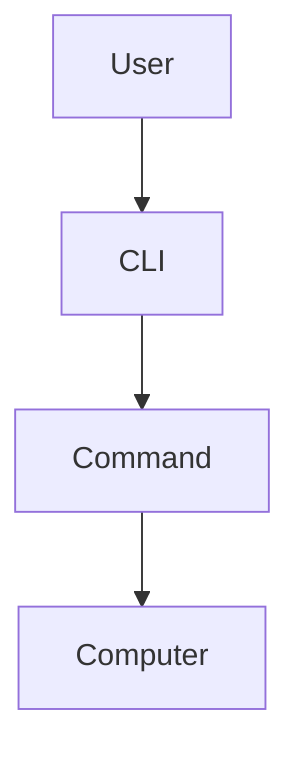

# PRD / STAGE V0 — Personal Vibe Coding Assistant

## 1. Tujuan Dokumen

Dokumen ini adalah acuan implementasi **versi pertama (V0)** aplikasi personal AI assistant untuk membantu user yang sangat pemula dalam dunia vibe coding dan software development.

Prioritas V0 adalah:

> **secepat mungkin menjadi aplikasi yang benar-benar bisa dipakai untuk bertanya, memahami istilah/error/konsep, dan menyimpan percakapan untuk dicari lagi nanti.**

Aplikasi **bukan SaaS**, bukan platform belajar lengkap, dan belum perlu fitur project management atau codebase assistant.

---

# 2. Latar Belakang Masalah

User adalah seorang **super-newbie dalam dunia vibe coding**.

Saat menggunakan AI coding tools seperti Antigravity, user sering menemukan:

- istilah teknis yang tidak dipahami;
- pesan error;
- potongan kode;
- output terminal;
- konsep software engineering;
- architecture terms;
- database terms;
- Git / CLI terms;
- screenshot dari IDE, browser, terminal, atau dokumentasi;
- keputusan teknis yang tidak dimengerti.

Masalah utama bukan sekadar mencari definisi.

User membutuhkan AI yang bisa:

1. menerima pertanyaan dalam bahasa natural;
2. memahami teks, kode, maupun screenshot;
3. menjelaskan dengan cara yang sangat mudah dipahami;
4. menggunakan persona/agent yang sesuai dengan konteks pertanyaan;
5. memungkinkan percakapan lanjutan sampai user benar-benar paham;
6. menyimpan seluruh percakapan;
7. memungkinkan percakapan lama dicari kembali.

---

# 3. Product Vision

Versi awal aplikasi berfungsi sebagai:

> **Personal AI Companion untuk menerjemahkan dunia vibe coding ke bahasa super pemula.**

Pengalaman utama harus sesederhana:

```text
User menemukan sesuatu yang tidak dipahami
        ↓
Buka aplikasi
        ↓
Ketik / paste / upload screenshot
        ↓
AI menentukan persona yang paling relevan
        ↓
AI menjelaskan
        ↓
User bertanya lagi jika belum paham
        ↓
Conversation otomatis tersimpan
        ↓
Bisa dicari kembali kapan saja
```

Untuk V0, fokus hanya pada:

> **Ask → Explain → Continue Conversation → Save → Search Again**

---

# 4. Target User

Hanya **1 user pribadi**.

Tidak perlu merancang aplikasi sebagai produk publik.

Asumsi user:

- sangat pemula;
- menggunakan AI untuk membantu coding;
- tidak selalu memahami istilah software engineering;
- tidak membutuhkan pengaturan role/user;
- lebih nyaman dengan pengalaman seperti ChatGPT;
- akan menggunakan aplikasi ini sebagai kamus + mentor pribadi.

---

# 5. Core Experience

UI utama mengikuti mental model ChatGPT.

Layout desktop:

```text
┌───────────────────┬────────────────────────────────────┐
│                   │                                    │
│   + New Chat      │                                    │
│                   │              CHAT                  │
│   Search          │                                    │
│                   │                                    │
│   History         │                                    │
│   Conversation    │                                    │
│                   │                                    │
│                   ├────────────────────────────────────┤
│                   │  Message...   Attachment    Send   │
└───────────────────┴────────────────────────────────────┘
```

Tidak perlu dashboard sebelum chat.

Saat aplikasi dibuka, user harus bisa langsung bertanya.

---

# 6. AI Behavior & Persona Configuration

Aplikasi harus mendukung **persona/response behavior yang configurable**.

Seluruh detail tentang:

- persona apa saja yang tersedia;
- nama persona;
- role persona;
- kapan persona tertentu dipilih;
- cara persona memperkenalkan diri;
- gaya bahasa;
- cara menjelaskan;
- analogi;
- struktur jawaban;
- aturan diagram/mind map;
- dan aturan routing;

**tidak ditentukan di PRD ini.**

Semua aturan tersebut harus berasal dari:

```text
/docs/assistant-brief.md
```

PRD hanya menetapkan kebutuhan fungsional berikut:

```text
User Message
    ↓
AI Behavior / Persona Router
    ↓
Membaca aturan dari assistant-brief.md
    ↓
Memilih behavior/persona yang sesuai
    ↓
Menghasilkan jawaban sesuai brief
```

Implementasi harus memastikan logic ini tidak di-hardcode ke UI dan mudah diubah hanya dengan memperbarui brief.

---

# 7. Assistant Brief

Aplikasi harus membaca file:

```text
/docs/assistant-brief.md
```

File ini adalah **sumber utama behavior AI**.

PRD tidak boleh menduplikasi isi brief.

Aplikasi cukup menyediakan mekanisme agar brief dapat digunakan oleh AI pada setiap response.

Buat satu mekanisme prompt builder terpusat yang menggabungkan:

```text
Base System Instruction
        +
assistant-brief.md
        +
Conversation Context
        +
User Message
```

Jika `assistant-brief.md` mengatur persona/routing, prompt builder dan AI layer harus mengikuti aturan tersebut.

**Jangan hardcode teaching style, persona, nama agent, atau aturan routing ke banyak file/component.**

---

# 8. Scope Fitur V0

## 8.1 Chat

Wajib tersedia:

- membuat conversation baru;
- mengirim pesan teks;
- paste potongan kode;
- multi-turn conversation;
- AI memahami konteks percakapan sebelumnya;
- loading state;
- error state;
- regenerate response sederhana jika mudah diimplementasikan;
- auto-scroll ke response terbaru.

---

## 8.2 Input Screenshot / Gambar

User dapat:

- upload screenshot;
- preview sebelum dikirim;
- menghapus attachment sebelum mengirim;
- mengirim gambar bersama prompt;
- AI menerima image input dan dapat menjelaskan isi screenshot.

Use case utama:

- screenshot error;
- screenshot terminal;
- screenshot Antigravity;
- screenshot UI;
- screenshot dokumentasi;
- screenshot kode.

Format minimal:

- PNG
- JPG / JPEG
- WEBP jika provider mendukung

Tidak perlu image editing.

---

## 8.3 Code Input

Jika user paste kode:

- tampilkan dengan formatting yang readable;
- assistant dapat menjelaskan kode;
- jawaban dapat berisi fenced code block;
- tersedia copy button pada code block.

Tidak perlu full code editor di V0.

Textarea/chat composer sudah cukup.

---

## 8.4 Markdown Rendering

Jawaban AI harus mendukung:

- heading;
- paragraph;
- bold;
- italic;
- bullet;
- numbered list;
- blockquote;
- inline code;
- fenced code block;
- table;
- link.

Gunakan markdown renderer yang aman.

---

## 8.5 Diagram / Mind Map

V0 harus bisa menampilkan visual berbasis teks jika AI menghasilkan diagram.

Implementasi paling sederhana:

**Mermaid.**

Minimal mendukung:

- flowchart;
- mind map jika syntax/library mendukung;
- sequence diagram jika diperlukan.

Contoh:



Jika Mermaid gagal dirender:

- jangan merusak seluruh response;
- tampilkan source diagram sebagai code block;
- tampilkan error state kecil/non-blocking.

Tidak perlu image generation untuk diagram V0.

---

# 9. Conversation History

Setiap conversation otomatis disimpan.

Data minimal:

```text
Conversation
- id
- title
- created_at
- updated_at
```

Setiap message:

```text
Message
- id
- conversation_id
- role
- content
- behavior_context nullable
- created_at
```

Attachment:

```text
Attachment
- id
- message_id
- file_path / file_url
- file_name
- mime_type
- created_at
```

Conversation harus tetap tersedia setelah browser/app ditutup lalu dibuka kembali.

---

# 10. Auto Title

Conversation baru boleh dimulai tanpa title.

Setelah pesan pertama:

- generate judul pendek otomatis berdasarkan topik;
- jangan menggunakan seluruh isi pertanyaan sebagai title;
- title dapat diedit manual.

Contoh:

```text
"Apa itu CLI?"
→ "Memahami CLI"

"Kenapa Supabase muncul RLS policy violation?"
→ "Error RLS Supabase"
```

---

# 11. Search Conversation

Search adalah fitur penting pada V0.

User dapat mencari conversation lama berdasarkan:

- title;
- isi pesan user;
- isi response assistant.

Contoh:

```text
Search:
middleware
```

Hasil dapat menampilkan conversation yang mengandung pembahasan tersebut.

Untuk V0:

- tidak perlu semantic/vector search;
- text search biasa sudah cukup;
- prioritaskan implementasi sederhana dan cepat.

Semantic search dapat menjadi upgrade berikutnya.

---

# 12. Sidebar

Sidebar minimal menyediakan:

- New Chat;
- Search;
- daftar conversation;
- grouping sederhana berdasarkan waktu jika mudah:
  - Today;
  - Previous 7 Days;
  - Older;
- rename;
- delete.

Tidak perlu folder conversation di V0.

---

# 13. Delete Conversation

Saat delete:

- minta confirmation;
- hapus conversation;
- hapus messages terkait;
- hapus attachment terkait jika memang disimpan secara lokal/storage.

---

# 14. Empty State

Ketika belum ada chat:

Tampilkan area sederhana seperti:

```text
Apa yang lagi bikin kamu bingung?
```

Boleh berisi contoh prompt kecil seperti:

```text
"Apa itu CLI?"
"Jelasin error ini"
"Apa bedanya API dan database?"
```

Jangan membuat homepage marketing.

---

# 15. Suggested Technical Architecture

Tujuan architecture adalah:

- simpel;
- cepat dibuat;
- personal;
- mudah dipahami;
- tidak mengunci aplikasi untuk pengembangan berikutnya.

Rekomendasi:

```text
Next.js
TypeScript
Tailwind CSS

        ↓

Server-side AI layer
        ↓

AI Provider Adapter

        ↓

Local/Persistent Database
```

Gunakan App Router.

---

# 16. AI Provider Architecture

Jangan memanggil AI provider langsung dari React component.

Buat layer terpisah, misalnya:

```text
src/
└── lib/
    └── ai/
        ├── provider.ts
        ├── router.ts
        ├── prompt-builder.ts
        ├── chat.ts
        └── types.ts
```

Tujuan:

```text
UI
↓
Application/API Layer
↓
AI Service
↓
Provider Adapter
↓
LLM Provider
```

Dengan demikian provider AI bisa diganti nanti tanpa rewrite UI.

Provider wajib mendukung:

- text;
- conversation context;
- image input / multimodal.

API key disimpan lewat environment variable.

Jangan expose secret API key ke browser.

---

# 17. AI Behavior Routing

Jika `assistant-brief.md` membutuhkan pemilihan persona atau behavior sebelum response diberikan, implementasikan routing secara sederhana pada AI layer.

Detail routing sepenuhnya mengikuti `assistant-brief.md`.

PRD tidak menentukan:

- daftar persona;
- nama persona;
- role persona;
- mapping topik ke persona;
- wording intro persona;
- aturan pemilihan persona.

Routing harus:

- terpisah dari UI;
- mudah diubah;
- tidak membutuhkan orchestration framework kompleks;
- dapat menggunakan lightweight AI classification atau mekanisme sederhana lain jika diperlukan.

Output internal boleh terstruktur agar mudah dipakai aplikasi, tetapi struktur final harus menyesuaikan brief.

---

# 18. Prompt Builder

Buat satu fungsi pusat.

Contoh konsep:

```text
buildSystemPrompt({
  assistantBrief,
  conversationContext,
  optionalBehaviorContext
})
```

Prompt final tidak boleh disusun tersebar di berbagai component.

Urutan logis:

```text
BASE SYSTEM
↓
ASSISTANT BRIEF
↓
OPTIONAL BEHAVIOR / PERSONA CONTEXT
↓
CURRENT CONVERSATION CONTEXT
↓
USER INPUT
```

---

# 19. Storage

Karena aplikasi digunakan pribadi, pilih persistence paling sederhana.

Preferensi implementasi V0:

- database lokal/persistent sederhana;
- schema migration jelas;
- attachment storage sederhana;
- jangan menggunakan infrastructure kompleks jika belum dibutuhkan.

Jika aplikasi dijalankan lokal, SQLite adalah pilihan yang valid.

Jika implementor memilih database lain, jelaskan alasan sebelum mengubah scope.

---

# 20. Suggested Data Model

## conversations

```text
id
title
created_at
updated_at
```

## messages

```text
id
conversation_id
role
content
behavior_context nullable
created_at
```

## attachments

```text
id
message_id
filename
mime_type
storage_path
created_at
```

Tidak perlu tabel user/authentication pada V0.

Tidak perlu tabel dictionary.

Tidak perlu tabel project.

Tidak perlu vector database.

---

# 21. Suggested Project Structure

Contoh, tidak wajib identik:

```text
src/
├── app/
│   ├── page.tsx
│   ├── chat/
│   │   └── [id]/
│   │       └── page.tsx
│   └── api/
│       └── chat/
│
├── components/
│   ├── chat/
│   ├── sidebar/
│   ├── markdown/
│   └── ui/
│
├── lib/
│   ├── ai/
│   │   ├── provider.ts
│   │   ├── router.ts
│   │   ├── prompt-builder.ts
│   │   └── behavior.ts
│   │
│   ├── db/
│   └── storage/
│
└── types/

/docs
└── assistant-brief.md
```

Jangan terlalu banyak abstraction sebelum dibutuhkan.

---

# 22. Visual Direction

V0 tidak perlu desain branding kompleks.

Arah UI:

- modern;
- clean;
- ringan;
- dark/light friendly;
- fokus keterbacaan;
- terasa seperti AI chat application;
- sidebar ringkas;
- chat width nyaman dibaca;
- code block jelas;
- diagram mudah dilihat.

Hindari:

- dashboard analytics;
- kartu statistik;
- gamification;
- learning streak;
- hero marketing;
- terlalu banyak gradient;
- animasi berlebihan.

---

# 23. Error Handling

Minimal tangani:

- AI provider gagal;
- API key belum ada;
- file terlalu besar;
- format gambar tidak didukung;
- upload gagal;
- response gagal;
- Mermaid syntax invalid;
- database gagal menyimpan.

Error harus menggunakan bahasa yang mudah dipahami.

Jangan hanya tampilkan raw stack trace ke user.

Untuk development, detail error tetap dapat ditulis ke server console.

---

# 24. Environment Configuration

Gunakan `.env.local`.

Contoh konsep:

```text
AI_PROVIDER=
AI_API_KEY=
AI_MODEL=
```

Jika database membutuhkan URL:

```text
DATABASE_URL=
```

Buat `.env.example`.

Jangan commit secret.

---

# 25. Non-Goals V0

**Jangan implementasikan fitur berikut pada Stage V0:**

- login;
- authentication;
- multi-user;
- role & permission;
- admin panel;
- billing;
- subscription;
- public profile;
- analytics dashboard;
- learning progress;
- streak;
- flashcard;
- dictionary page terpisah;
- project workspace;
- project planner;
- architecture generator;
- PRD generator;
- documentation center;
- codebase upload;
- codebase indexing;
- RAG;
- embeddings;
- vector database;
- GitHub integration;
- Git integration;
- IDE integration;
- agent collaboration;
- autonomous coding;
- voice;
- image generation;
- web search;
- mobile app native.

Semua hal di atas adalah kandidat upgrade setelah V0 benar-benar dipakai.

---

# 26. Future Direction — Jangan Dibangun Sekarang

Arsitektur boleh mempertimbangkan bahwa suatu hari aplikasi bisa berkembang menjadi:

```text
V0
Explain & Search

↓ later

Personal Knowledge

↓ later

Project Workspace

↓ later

Planning Assistant

↓ later

Architecture Assistant

↓ later

Documentation Center

↓ later

Debug / Codebase Assistant

↓ later

Full Personal Vibe Coding Companion
```

Namun **future roadmap tidak boleh memperbesar scope V0**.

---

# 27. Definition of Done

Stage V0 dianggap selesai jika seluruh alur berikut bekerja:

## Scenario 1 — Text

```text
User membuka aplikasi
→ New Chat
→ mengetik "CLI itu apa?"
→ sistem menjalankan behavior/routing sesuai assistant-brief.md
→ AI menjawab mengikuti assistant-brief.md
→ conversation tersimpan
```

## Scenario 2 — Follow-up

```text
User:
"Aku masih belum ngerti bagian terminalnya"

→ AI memahami konteks response sebelumnya
→ behavior/routing lanjutan mengikuti assistant-brief.md
→ AI menjawab tanpa kehilangan konteks
```

## Scenario 3 — Image

```text
User upload screenshot error
→ preview tampil
→ user kirim
→ AI memahami screenshot
→ AI menjelaskan isi/error
→ conversation + attachment tersimpan
```

## Scenario 4 — History

```text
User refresh / restart aplikasi
→ conversation sebelumnya tetap ada
→ klik conversation
→ seluruh message tampil kembali
```

## Scenario 5 — Search

```text
User search "CLI"
→ conversation yang membahas CLI muncul
→ klik hasil
→ conversation terbuka
```

## Scenario 6 — Diagram

```text
AI menghasilkan Mermaid
→ diagram dirender
→ jika syntax gagal, chat tetap tampil dan source masih dapat dibaca
```

---

# 28. Acceptance Criteria Utama

V0 diterima jika:

- [ ] aplikasi langsung membuka pengalaman chat;
- [ ] user dapat membuat conversation;
- [ ] user dapat mengirim text;
- [ ] user dapat paste code;
- [ ] user dapat upload screenshot;
- [ ] AI dapat memahami text + image;
- [ ] behavior/persona routing mengikuti `docs/assistant-brief.md`;
- [ ] output UI terkait persona/behavior mengikuti `docs/assistant-brief.md`;
- [ ] response mengikuti `docs/assistant-brief.md`;
- [ ] multi-turn context bekerja;
- [ ] Markdown tampil dengan benar;
- [ ] code block tampil dan dapat dicopy;
- [ ] Mermaid dapat dirender;
- [ ] conversation tersimpan;
- [ ] auto title bekerja;
- [ ] conversation history tampil;
- [ ] search conversation bekerja;
- [ ] rename conversation bekerja;
- [ ] delete conversation bekerja;
- [ ] attachment tersimpan;
- [ ] secret AI tidak diexpose ke client;
- [ ] `.env.example` tersedia;
- [ ] README berisi cara setup dan menjalankan aplikasi;
- [ ] tidak ada fitur di luar scope V0 yang dibangun tanpa kebutuhan.

---

# 29. Implementation Rule untuk Antigravity

Saat mengerjakan stage ini:

1. Baca dokumen ini secara penuh.
2. Baca `/docs/assistant-brief.md` jika file tersebut sudah tersedia.
3. Jika `assistant-brief.md` belum tersedia, buat placeholder yang jelas dan jangan mengarang teaching brief permanen.
4. Prioritaskan aplikasi bekerja end-to-end dibanding membuat architecture yang terlalu kompleks.
5. Jangan menambah fitur yang tidak ada di scope.
6. Jangan membuat authentication.
7. Jangan membuat multi-user.
8. Jangan membuat project workspace.
9. Jangan membuat vector database/RAG.
10. Pisahkan AI service dari UI.
11. Pisahkan prompt builder dari component.
12. Buat behavior/persona routing mudah diubah dan mengikuti `assistant-brief.md`.
13. Pastikan database persistence benar-benar bekerja.
14. Pastikan upload image benar-benar dapat dikirim ke AI model.
15. Pastikan seluruh setup dapat dijalankan dari README.
16. Setelah implementasi, lakukan smoke test pada semua scenario di Definition of Done.

---

# 30. Final Instruction

Bangun **Stage V0 saja**.

Tujuan stage ini bukan membuat AI developer paling lengkap.

Tujuannya adalah membuat aplikasi personal yang sederhana tetapi benar-benar berguna:

> **setiap kali user menemukan sesuatu yang tidak dimengerti saat vibe coding, user dapat membuka aplikasi ini, bertanya, mendapatkan penjelasan dari persona yang relevan, melanjutkan percakapan sampai paham, lalu menemukan kembali percakapan tersebut di kemudian hari.**
